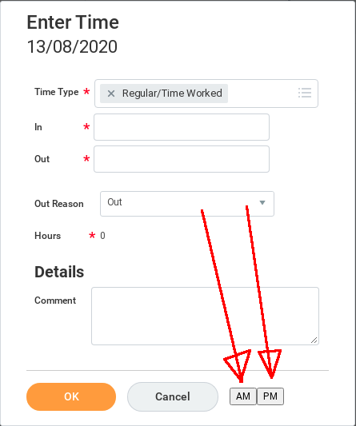

= `wd-enter-time-chrome-extension`

A Google Chrome extension to make entering working hours into Workday a bit less tedious.

== What it does

It adds two buttons to the Enter time dialog. These buttons autofill some
https://github.com/ppalaga/wd-enter-time-chrome-extension/blob/master/wd-enter-time-chrome-extension.js#L2-L3[hardcoded values]
into the form and submit it. Sorry, no configuration options at this time, but contributions are welcome!

== How to run

[source,shell]
----
cd ~/git
git clone --origin upstream https://github.com/ppalaga/wd-enter-time-chrome-extension.git
# Option 1: Chrome CLI
google-chrome --load-extension=wd-enter-time-chrome-extension
# Or option 2: follow http://developer.chrome.com/extensions/getstarted.html#unpacked
----

== How to get notified about updates

Activate watching on link:https://github.com/ppalaga/wd-enter-time-chrome-extension[] project.

== How to update

[source,shell]
----
cd wd-enter-time-chrome-extension
git checkout master
git fetch upstream # upstream is https://github.com/ppalaga/wd-enter-time-chrome-extension.git
git reset --hard upstream/master
----

After the fetch/reset, visit link:chrome://extensions/[chrome://extensions/] in Google Chrome and Reload with `CTRL+R`.

